<picture>
  <source media="(prefers-color-scheme: dark)" srcset="./assets/stats-dark.svg">
  <source media="(prefers-color-scheme: light)" srcset="./assets/stats-light.svg">
  
</picture>
<picture>
  <source media="(prefers-color-scheme: dark)" srcset="./assets/langs-dark.svg">
  <source media="(prefers-color-scheme: light)" srcset="./assets/langs-light.svg">
  
</picture>

  

---

Statistics are rendered daily by GitHub Actions and served directly from this repository — no external endpoint, no rate limiting.
